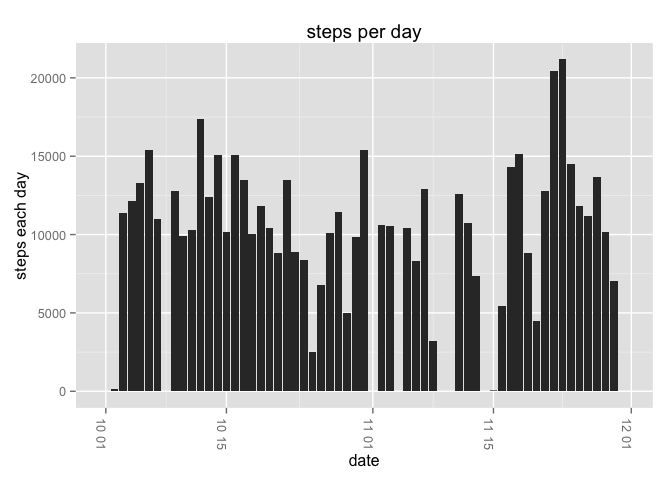
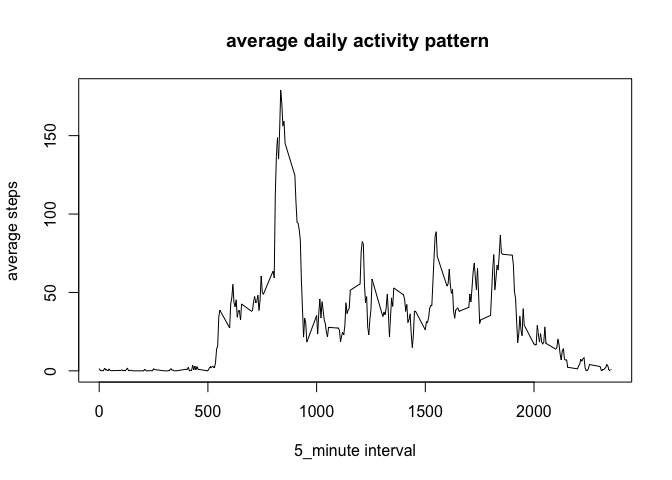
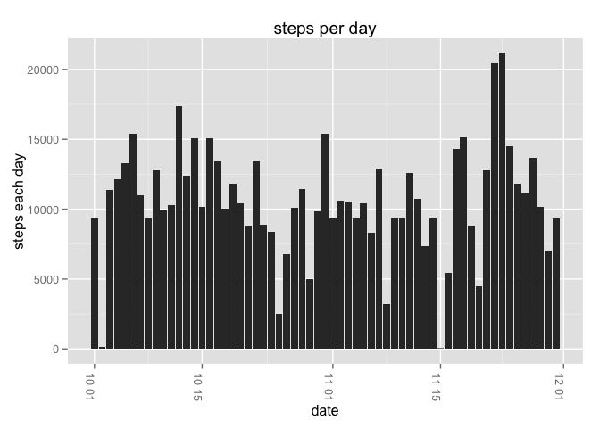
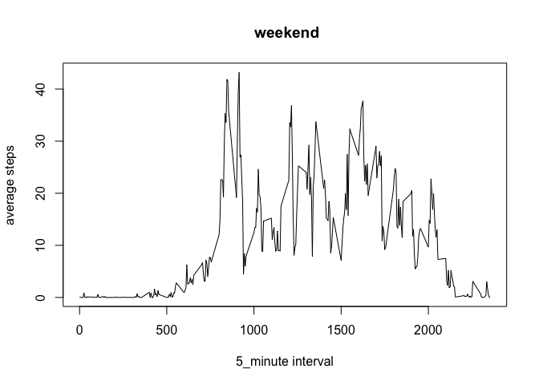
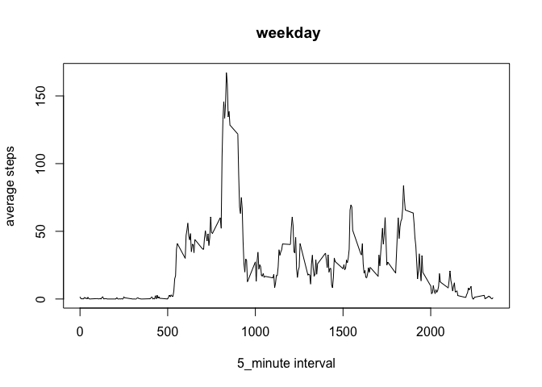

# Reproducible Research: Peer Assessment 1


## Loading and preprocessing the data


```r
d<-read.csv("activity.csv")
d$date<-as.Date(d$date)
head(d)
```

```
##   steps       date interval
## 1    NA 2012-10-01        0
## 2    NA 2012-10-01        5
## 3    NA 2012-10-01       10
## 4    NA 2012-10-01       15
## 5    NA 2012-10-01       20
## 6    NA 2012-10-01       25
```

## What is mean total number of steps taken per day?

```r
dat<-unique(d$date)
num<-sapply(dat,function(x){sum(d[!is.na(d$steps)&(d$date==x),1])})
nd<-data.frame(dat,num)
library(ggplot2)
g<-ggplot(nd,aes(dat,num))
g<-g+geom_bar(stat = "identity")
g<-g+labs(x="date")
g<-g+labs(y="steps each day")
g<-g+theme(axis.text.x=element_text(angle=270))
g<-g+labs(title="steps per day")
print(g)
```

 

```r
mea<-round(mean(num),2)
med<-median(num)
meda<-dat[num==med]
```

The ***mean*** of total number of steps taken per day is 9354.23.

The ***median*** of total number of steps taken per day is 10395 ,the ***date*** is 2012-10-20.


## What is the average daily activity pattern?


```r
inter<-unique(d$interval)
averd<-sapply(inter,function(x){sum(d[!is.na(d$steps)&(d$interval==x),1])/length(dat)})
ftime<-sapply(inter,function(x){fh<-round(x/100,0);fm<-x %% 100;paste(fh,fm,sep=":")})
plot(inter,averd,type="l",xlab = "5_minute interval",ylab="average steps",main =" average daily activity pattern")
```

 

```r
maxtime<-inter[averd==max(averd)]
maxv<-round(max(averd),2)
h<-round(maxtime/100,0)
m<-maxtime %% 100
maxt<-paste(h,m,sep=":")
maxtt<-paste(h,m+5,sep=":")
```


On average across all the days in the dataset,the ***maxinum*** number of steps is 179.13 at 8:35 ***to*** 8:40.

## Imputing missing values


```r
s<-sum(is.na(d$steps))
```
The total number of rows with NAs is 2304

```r
nna<-d[is.na(d$steps),3]
meanna<-sapply(nna,function(x){averd[inter==x]})
d[is.na(d$steps),1]<-meanna
num1<-sapply(dat,function(x){sum(d[(d$date==x),1])})
nd<-data.frame(dat,num1)
g<-ggplot(nd,aes(dat,num1))
g<-g+geom_bar(stat = "identity")
g<-g+labs(x="date")
g<-g+labs(y="steps each day")
g<-g+theme(axis.text.x=element_text(angle=270))
g<-g+labs(title="steps per day")
print(g)
```

 

```r
mew<-mean(num1)
meed<-median(num1)
meeda<-dat[num1==meed]
```

The ***mean*** of total number of steps taken per day is 1.0581014\times 10^{4}.

The ***median*** of total number of steps taken per day is 1.0395\times 10^{4} ,the ***date*** is 2012-10-20.

The mean is bigger than first part of the assignment,but the median is still the same one.

## Are there differences in activity patterns between weekdays and weekends?

```r
ddd<-data.frame(d,l="")
ddd[,4]<-sapply(ddd$date,function(x){weekdays(x)})
ddd[,4]<-sapply(ddd$l,function(x){
  if(x=="星期日"|x=="星期六")
  {"weekend"}else{
    "weekday"  
    }
   })
weekdayaverd<-sapply(inter,function(x){sum(d[!is.na(ddd$steps)&(ddd$interval==x)&(ddd$l=="weekday"),1])/length(dat)})
weekendaverd<-sapply(inter,function(x){sum(d[!is.na(ddd$steps)&(ddd$interval==x)&(ddd$l=="weekend"),1])/length(dat)})
plot(inter,weekendaverd,type="l",xlab = "5_minute interval",ylab="average steps",main =" weekend")
```

 

```r
plot(inter,weekdayaverd,type="l",xlab = "5_minute interval",ylab="average steps",main =" weekday")
```

 


